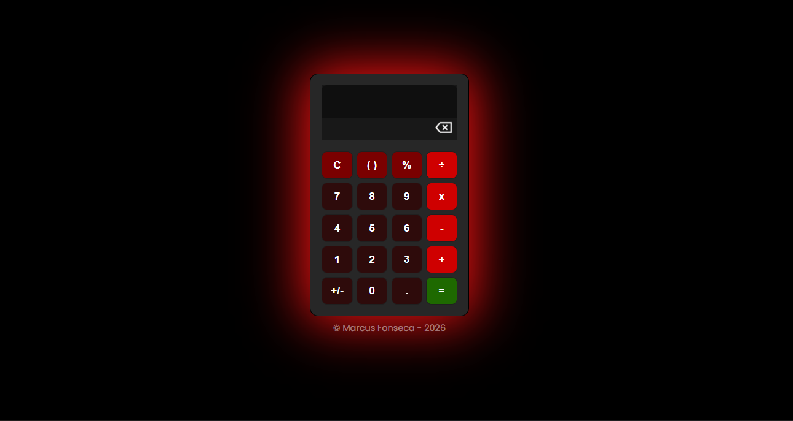

# 🧮 Calculadora Web

Uma calculadora simples e funcional desenvolvida com HTML, CSS e JavaScript, com foco em interface moderna e experiência do usuário.

## 🚀 Funcionalidades
- Operações básicas: soma, subtração, multiplicação e divisão
- Interface responsiva
- Botão de limpar (C)
- Botão de apagar (←)
- Suporte a números decimais

## 🎨 Interface

O projeto conta com um design moderno, utilizando cores agradáveis e organização intuitiva dos botões, proporcionando uma boa usabilidade tanto em desktop quanto em dispositivos móveis.

## 🛠️ Tecnologias utilizadas
 

## 📸 Preview

 

## 📌 Melhorias futuras
- Adicionar histórico de cálculos
- Melhorar animações e transições
- Adicionar modo dark/light
- Atualização dinâmica do display

### 👨‍💻 Autor
- Desenvolvido por Marcus Fonseca
